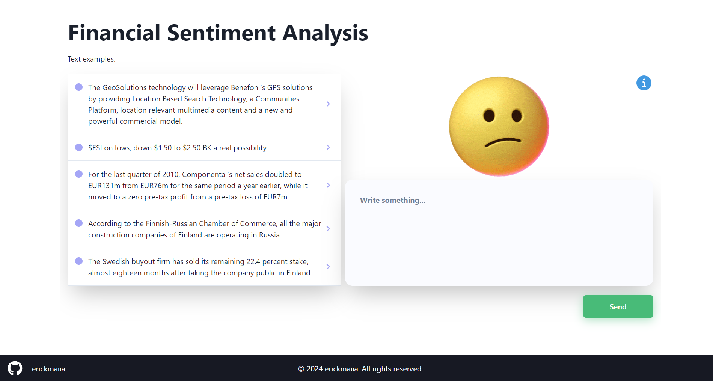

# Financial Sentiment Analysis Interface

This is a web application for financial sentiment analysis, developed using React with Vite, TypeScript, and Chakra UI. It utilizes Axios to make requests to an API created for text data processing. For more information, visit the link. The website is hosted on Vercel.

## Features

- Visualization of financial sentiments based on GitHub repository data.
- User-friendly and responsive user interface.
- Text data processing through POST requests.

## Technologies Used

- **React**: JavaScript library for building user interfaces.
- **Vite**: Fast build tool for modern web projects.
- **TypeScript**: Typed programming language that integrates well with JavaScript.
- **Chakra UI**: component library that makes it easy to create accessible and beautiful designs.
- **Axios**: Promise-based HTTP client for making HTTP requests.
- **Vercel**: Hosting platform for front-end and back-end applications.

## Used API

The requests in this application are made to an API specifically created to provide financial sentiment data. For more information about this API, visit the [link](https://github.com/erickmaiia/rest-api-reply-model-v1) to the API repository.

## Production Website

You can visually access [here](https://interface-reply-model.vercel.app/) or click in the image.

